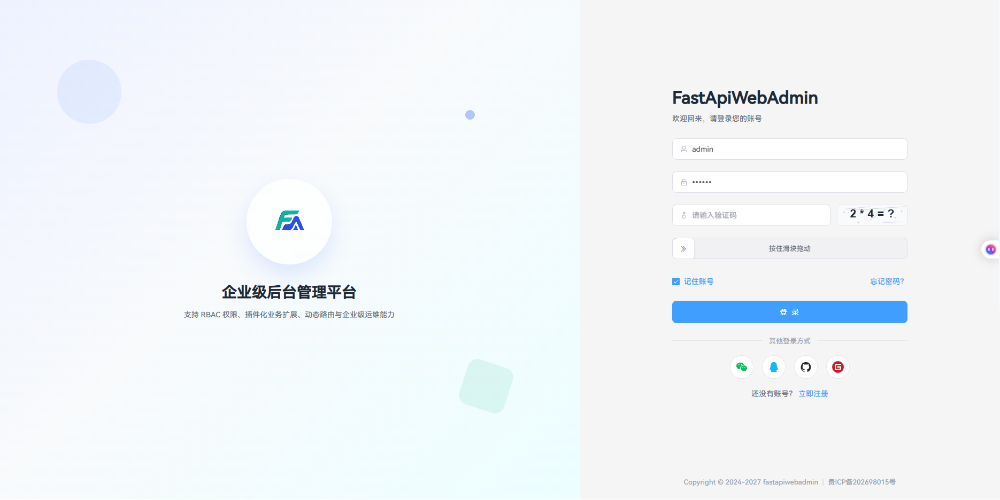

# FastAPI Web Admin

<div align="center">

**基于 FastAPI + Vue3 的企业级后台管理系统**

前后端分离 · RBAC 权限 · 插件化业务扩展 · 动态路由

[](https://www.python.org/)
[](https://fastapi.tiangolo.com/)
[](https://vuejs.org/)
[](LICENSE)

</div>

---

## 项目简介

FastAPI Web Admin 是一套开箱即用的后台管理脚手架，后端采用 **系统模块 + 业务插件** 分离架构，前端基于 Vue3 + Element Plus。

**核心能力：**

- RBAC 权限（菜单 / 按钮 / 接口）
- 动态路由与菜单配置
- 业务插件自动发现与注册
- Alembic 数据库版本管理
- uv 依赖管理与统一 CLI
- 开发环境自动建表与种子数据

**默认账号：** `admin` / `123456`

---

## 技术栈

| 层级 | 技术 |
|------|------|
| 后端 | FastAPI、SQLAlchemy 2.0、Pydantic v2、Alembic、Celery、Redis |
| 前端 | Vue 3、Vite、TypeScript、Element Plus、Pinia |
| 数据库 | MySQL 8.x（推荐） |
| 包管理 | 后端 [uv](https://docs.astral.sh/uv/)，前端 yarn / npm |

---

## 仓库结构

```
fastapiwebadmin/
├── backend/                 # 后端（Python / FastAPI）
│   ├── main.py              # 唯一入口：create_app + CLI
│   ├── pyproject.toml       # 依赖声明（uv 源）
│   ├── uv.lock
│   ├── alembic.ini
│   ├── env/                 # 环境配置（唯一配置目录）
│   │   ├── .env.dev.example
│   │   └── .env.prod.example
│   ├── db_script/           # 种子 SQL（db_init.sql）
│   ├── app/
│   │   ├── api/v1/          # 系统 API（controller / service / schema / model）
│   │   ├── plugin/          # 业务插件（fea_project、fea_celery 等）
│   │   ├── models/          # 仅 base.py 公共 ORM 基类
│   │   ├── core/            # 日志、建表、插件发现
│   │   ├── config/          # setting.py / path_conf.py
│   │   ├── scripts/         # init_app.py、initialize.py
│   │   ├── alembic/         # 迁移脚本
│   │   ├── db/              # 数据库 / Redis 连接
│   │   ├── common/          # 枚举、公共 Schema、响应模型
│   │   ├── corelibs/        # 路由封装、错误码、上下文 g
│   │   └── init/            # 异常处理、限流器
│   ├── run_win.bat          # Windows 开发菜单
│   └── run_linux.sh         # Linux 开发脚本
│
├── frontend/                # 前端（Vue3）
│   └── src/
│       ├── api/             # 接口封装
│       ├── views/           # 页面
│       ├── components/      # 公共组件（synrebort-table 等）
│       └── ...
│
└── README.md
```

> **注意：** 旧版 `app/apis/`、`app/services/`、`app/schemas/`、`config.py`、`cli.py` 已移除。所有开发请遵循下方规范，勿在废弃路径下新增代码。

---

## 后端开发规范

### 1. 模块四层约定（标准）

**每个业务模块固定四层文件**，目录即模块边界：

```
<module>/
├── controller.py    # 接口层：路由、入参校验、调用 service
├── service.py       # 业务层：业务逻辑、事务编排
├── schema.py        # 契约层：Pydantic 请求/响应/查询模型
└── model.py         # 数据层：SQLAlchemy ORM 模型（继承 Base）
```

**调用链（单向）：**

```
HTTP 请求 → controller → service → model → 数据库
              ↑            ↑
           schema       schema（入参/出参类型）
```

| 文件 | 职责 | 禁止 |
|------|------|------|
| `controller.py` | 定义 `APIRouter`、绑定路由、返回 `HttpResponse` | 不写 SQL、不写复杂业务 |
| `service.py` | 业务规则、组合多个 model 操作 | 不直接处理 HTTP Request |
| `schema.py` | 入参校验、序列化，继承 `BaseSchema` | 不访问数据库 |
| `model.py` | 表结构、查询/分页等数据访问方法 | 不写 HTTP 相关逻辑 |

**系统模块示例：**

```
app/api/v1/system/user/
├── controller.py
├── service.py
├── schema.py
└── model.py          # User 表
```

**业务插件示例：**

```
app/plugin/fea_project/project/
├── controller.py
├── service.py
├── schema.py
└── model.py          # ProjectInfo 等
```

> `model.py` 会被 `ImportUtil` 自动扫描，启动时 `create_all` 自动建表，无需注册到 Alembic。

### 2. 严格四层

除 `app/models/base.py` 公共基类外，**所有业务定义必须在模块目录内完成**，禁止集中到 `system_models.py` 等共享文件。

```
<module>/
├── controller.py
├── service.py
├── schema.py
└── model.py
```

**允许仅保留的公共层：**

| 路径 | 内容 |
|------|------|
| `app/models/base.py` | ORM 声明基类 `Base` |
| `app/common/schema.py` | Pydantic 基类 `BaseSchema` |
| `app/common/response.py` | 统一响应模型 |
| `app/config/` | 配置 |

### 3. 例外模块（允许不足四层）

| 类型 | 示例 | 说明 |
|------|------|------|
| 纯工具接口 | `health/` | 仅 `controller.py`，无持久化 |
| 透传/聚合 | `id_center/` | 仅转发，无独立表 |
| 基础设施插件 | `fea_celery/` | 无 HTTP，含 `worker.py` + `tasks/` |
| 仅表无接口 | `notify/`、`request_history/` | 暂仅 `model.py`，预留扩展 |

### 4. 目录归属

| 位置 | 用途 |
|------|------|
| `app/api/v1/system/<module>/` | 系统内置模块（用户、角色、菜单…） |
| `app/api/v1/common/<module>/` | 公共能力（文件、健康检查） |
| `app/plugin/fea_<name>/<module>/` | 业务插件模块 |
| `app/common/` | 跨模块公共：`BaseSchema`、响应模型、枚举 |
| `app/config/setting.py` | 唯一配置入口 |

**禁止：**

- 在 `backend/` 根目录新建 `config.py` 或第二套配置
- 新建 `apis/`、`services/` 平级目录
- 新功能把 ORM 写进集中式 `*_models.py` 文件
- 通过 re-export shim 做「兼容旧路径」

### 5. 路由注册

- 系统 API：在 `app/api/v1/system/router.py` 聚合，前缀 `/api`
- 业务插件：`discover.py` 扫描 `fea_*/**/controller.py`，自动挂载

### 6. 业务插件规范

插件目录名必须以 `fea_` 开头：

```
app/plugin/fea_project/
├── plugin.toml
└── project/                 # 子模块，遵循四层约定
    ├── controller.py
    ├── service.py
    ├── schema.py
    ├── model.py
```

`fea_celery`（后台任务插件，无 HTTP 四层中的 controller）：

```
app/plugin/fea_celery/
├── plugin.toml
├── worker.py
├── model.py
├── schema.py
├── tasks/
└── scheduler/
```

### 7. 配置与环境

```bash
# 开发
cp backend/env/.env.dev.example backend/env/.env.dev

# 生产
cp backend/env/.env.prod.example backend/env/.env.prod
```

通过 `ENVIRONMENT` 切换：`dev` / `prod`。配置只读 `backend/env/.env.{env}`，不使用根目录 `.env`。

关键项：

| 变量 | 开发建议 | 生产建议 |
|------|----------|----------|
| `AUTO_CREATE_TABLES` | `True`（空库自动建表） | `False`（仅用 Alembic） |
| `AUTO_SEED_DATA` | `True`（空库导入种子） | `False` |
| `SEED_SQL_FILE` | `db_script/db_init.sql` | 不启用 |

### 8. 日志

- 控制台 + `backend/logs/info.log` + `backend/logs/error.log`
- 使用 `from app.core.logger import log, logger`

### 9. 代码风格

- Python 3.10+，函数与公共方法加类型注解
- 遵循 PEP 8
- Schema 继承 `app.common.schema.BaseSchema`
- API 响应统一走 `app.utils.response.HttpResponse`

---

## 快速开始

### 环境要求

- Python 3.10+
- Node.js 18+
- MySQL 8.0+
- Redis 6+（限流 / Celery 需要）
- [uv](https://docs.astral.sh/uv/getting-started/installation/)

### 1. 创建数据库

```sql
CREATE DATABASE fastapiwebadmin CHARACTER SET utf8mb4 COLLATE utf8mb4_unicode_ci;
```

### 2. 后端

```bash
cd backend

# 安装依赖
uv sync

# 配置环境（首次）
cp env/.env.dev.example env/.env.dev
# 编辑 env/.env.dev：数据库、Redis 等

# 方式 A：开发菜单（Windows）
run_win.bat

# 方式 B：命令行
uv run main.py run --env=dev
```

服务地址：

- API：http://127.0.0.1:8100
- 文档：http://127.0.0.1:8100/docs

**Linux 快捷脚本：**

```bash
./run_linux.sh sync    # 安装依赖
./run_linux.sh dev     # 启动开发服务
```

### 3. 前端

```bash
cd frontend
yarn install    # 或 npm install
yarn dev        # 开发：http://localhost:3000
```

开发模式下 Vite 将 `/api` 代理到 `http://127.0.0.1:8100`，无需改接口路径。

### 4. 首次初始化数据库

**开发环境（推荐）：** 启动时若库为空，会自动建表并导入 `db_script/db_init.sql`。

也可手动重置（会删表重建）：

```bash
cd backend
uv run main.py reset --env=dev
```

**生产环境：** 关闭 `AUTO_CREATE_TABLES` 与 `AUTO_SEED_DATA`，使用 Alembic（见下文）。

---

## CLI 命令参考

所有命令在 `backend/` 目录执行：

```bash
uv run main.py <command> --env=dev|prod
```

| 命令 | 说明 |
|------|------|
| `run` | 启动 HTTP 服务 |
| `revision -m "描述"` | 根据模型变更生成迁移脚本 |
| `upgrade` | 应用迁移至最新（head） |
| `upgrade -r <revision>` | 升级到指定版本 |
| `downgrade` | 回滚一个版本 |
| `current` | 查看当前迁移版本 |
| `history` | 查看迁移历史 |
| `reset` | 删表重建 + 种子数据（仅 dev） |

---

## 数据库与迁移

### 开发环境（默认，推荐）

开启 `AUTO_CREATE_TABLES=True` 后，**每次启动**会自动：

1. 扫描全项目各模块下的 `model.py`
2. 对缺失表执行 `create_all`（含新业务插件）

新增业务模块时：**写好 `model.py` 重启服务即可**，不必改 Alembic 配置。

### 生产环境

关闭自动建表，使用 Alembic 显式迁移：

```ini
AUTO_CREATE_TABLES = False
AUTO_SEED_DATA = False
```

### Alembic（可选，用于生产版本管理）

迁移目录：`backend/app/alembic/versions/`。执行 `revision` 时同样通过 `ImportUtil` 自动发现模型，**无需手动注册**。

### 日常模型变更流程

1. **修改 ORM 模型**（`app/models/`）
2. **生成迁移脚本**

```bash
cd backend
uv run main.py revision --env=dev -m "add xxx column"
```

3. **检查生成的文件**（`app/alembic/versions/xxxx_*.py`），确认 `upgrade()` / `downgrade()` 无误
4. **应用迁移**

```bash
uv run main.py upgrade --env=dev
```

5. **提交迁移文件到 Git**（与模型变更同一 PR）

### 生产发布

```bash
# 1. 部署代码
# 2. 备份数据库
# 3. 应用迁移
uv run main.py upgrade --env=prod
# 4. 重启服务
```

生产环境请设置：

```ini
AUTO_CREATE_TABLES = False
AUTO_SEED_DATA = False
```

避免 `create_all` 与 Alembic 状态不一致。

### 回滚

```bash
uv run main.py downgrade --env=dev        # 回滚 1 个版本
uv run main.py downgrade --env=dev -r -2  # 回滚 2 个版本
uv run main.py history --env=dev          # 查看版本链
```

### 开发环境一键重置

当本地库混乱、种子数据异常时：

```bash
uv run main.py reset --env=dev
```

等价于：删表 → `create_tables()` → 导入 `db_init.sql`。

### 新增模型检查清单

- [ ] 在对应模块下创建 `model.py`，模型继承 `Base`
- [ ] 开发环境重启服务，确认表已自动创建
- [ ] 生产环境再执行 `revision` → `upgrade`

---

## 生产部署

### 后端（Gunicorn + Uvicorn）

```bash
cd backend
uv sync --no-dev
cp env/.env.prod.example env/.env.prod
# 编辑生产配置

uv run main.py upgrade --env=prod

gunicorn "main:create_app()" \
  --factory \
  -w 4 \
  -k uvicorn.workers.UvicornWorker \
  -b 0.0.0.0:8100
```

或使用 `start.sh`：

```bash
./start.sh app 8100
```

### Celery 插件（可选）

异步任务已作为业务插件 `app/plugin/fea_celery/` 提供，不启用时不影响主服务。

```bash
cd backend

# Worker（Windows 使用 --pool=solo）
celery -A app.plugin.fea_celery.worker.celery worker --pool=solo -l INFO

# Beat（数据库调度器）
celery -A app.plugin.fea_celery.worker.celery beat \
  -S app.plugin.fea_celery.scheduler.schedulers:DatabaseScheduler -l INFO
```

或使用 `start.sh`：

```bash
./start.sh celery-worker 8100
./start.sh celery-beat 8100
```

新增任务：在 `app/plugin/fea_celery/tasks/` 下编写，并在 `plugin.toml` 的 `[celery].tasks` 中注册。

### 前端

```bash
cd frontend
yarn build
# 将 dist/ 部署到 Nginx 等静态服务器
```

Nginx 需将 `/api` 反向代理到后端 `8100` 端口。

---

## 前端开发规范（摘要）

```
frontend/src/
├── api/              # 按模块封装 HTTP 请求
├── views/            # 页面（system/ 为系统管理）
├── components/       # 公共组件（synrebort-table、synrebort-card）
├── router/           # 路由与守卫
├── stores/           # Pinia 状态
└── utils/request.ts  # Axios 封装
```

- 组件目录使用 **kebab-case**（如 `synrebort-table/`）
- 全局组件在 `utils/other.ts` 注册
- 权限按钮使用 `v-permission` 指令

---

## 常见问题

**Q: 登录失败 / 用户不存在？**

开发环境执行 `uv run main.py reset --env=dev` 重新导入种子数据。

**Q: Redis 报错 `AUTH but no password is set`？**

本地 Redis 无密码时，将 `env/.env.dev` 中 `REDIS_PASSWORD` 留空，`REDIS_URI` 不要带密码段。

**Q: 前端请求不到后端？**

确认后端已启动在 8100，且 `frontend/vite.config.ts` 代理 `/api` → `8100`。

**Q: bcrypt 密码错误？**

项目固定 `bcrypt==4.0.1`（与 passlib 兼容），请使用 `uv sync` 安装锁定版本。

**Q: 新人误改旧目录？**

`app/apis`、`app/services`、`config.py`、`cli.py` 已删除。只按本文「后端开发规范」在 `api/v1` 或 `plugin` 下开发。

---

## 测试

```bash
cd backend
uv run pytest
```

---

## 系统截图

### 登录页


### 首页


### 路由菜单管理


---

## 开源协议

本项目采用 [MIT](LICENSE) 协议。

## 相关链接

- [FastAPI 文档](https://fastapi.tiangolo.com/)
- [Vue 3 文档](https://vuejs.org/)
- [Element Plus](https://element-plus.org/)
- [uv 文档](https://docs.astral.sh/uv/)

---

<div align="center">

**Made with ❤️ by Rebort**

</div>
